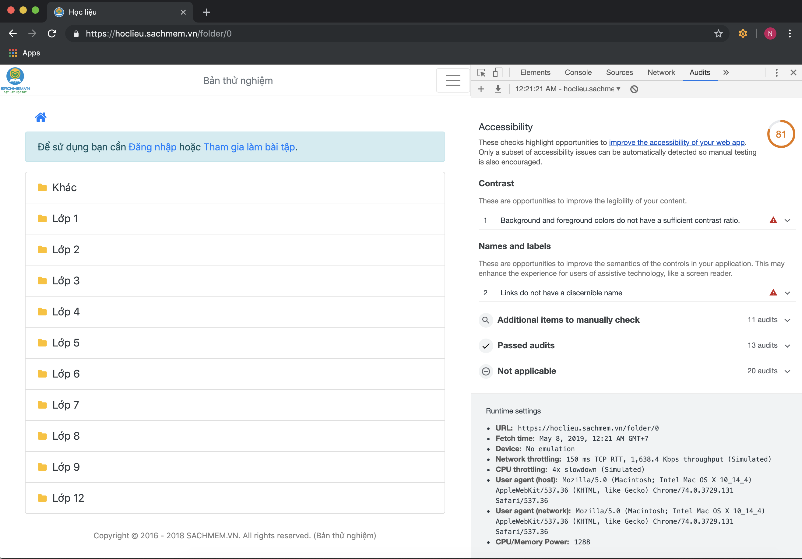
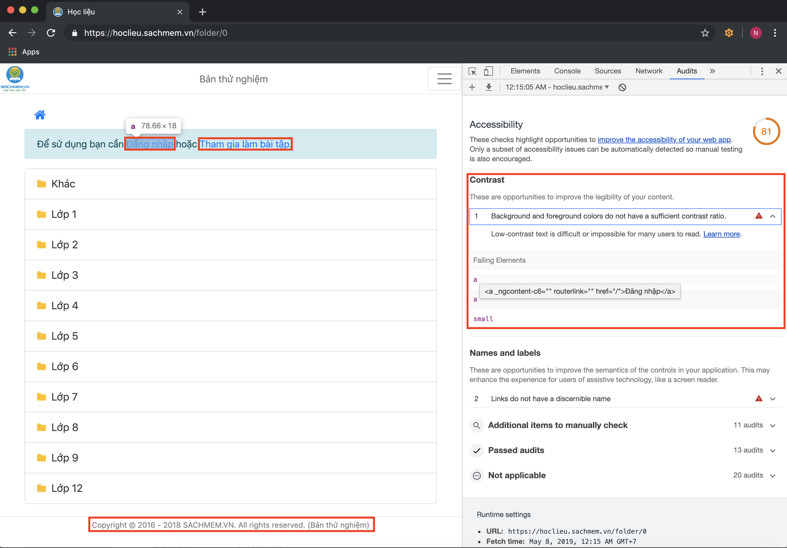
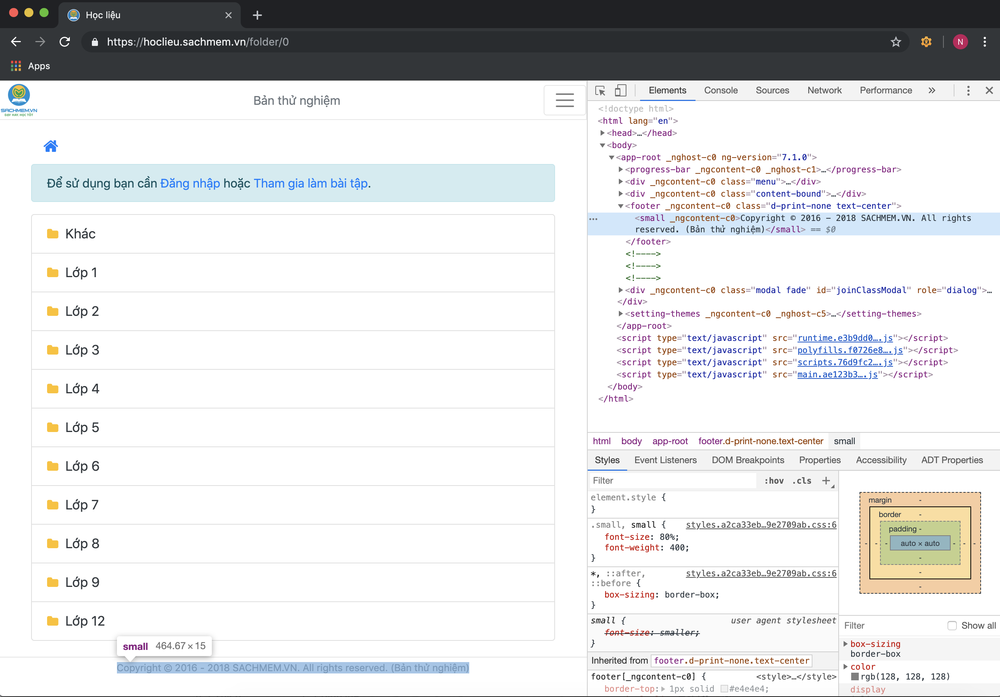
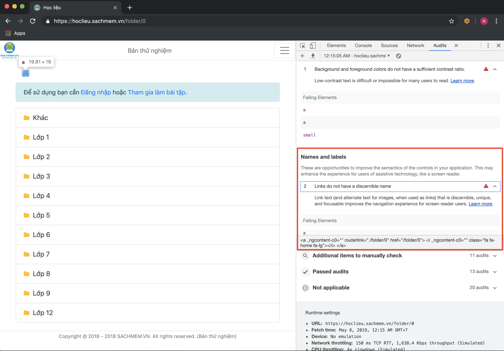
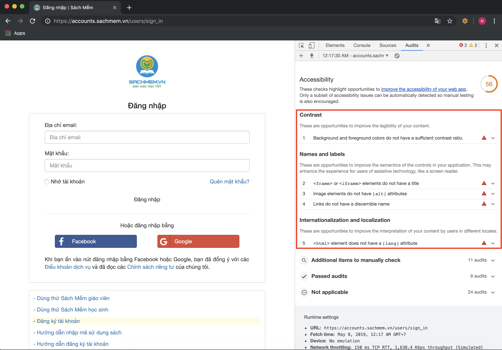
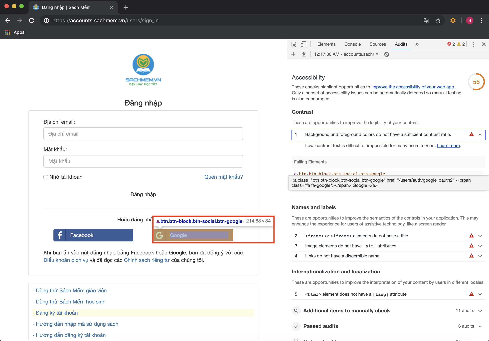
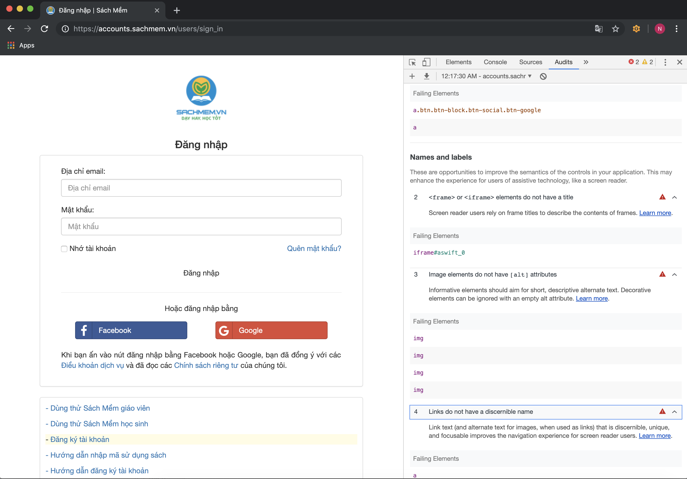
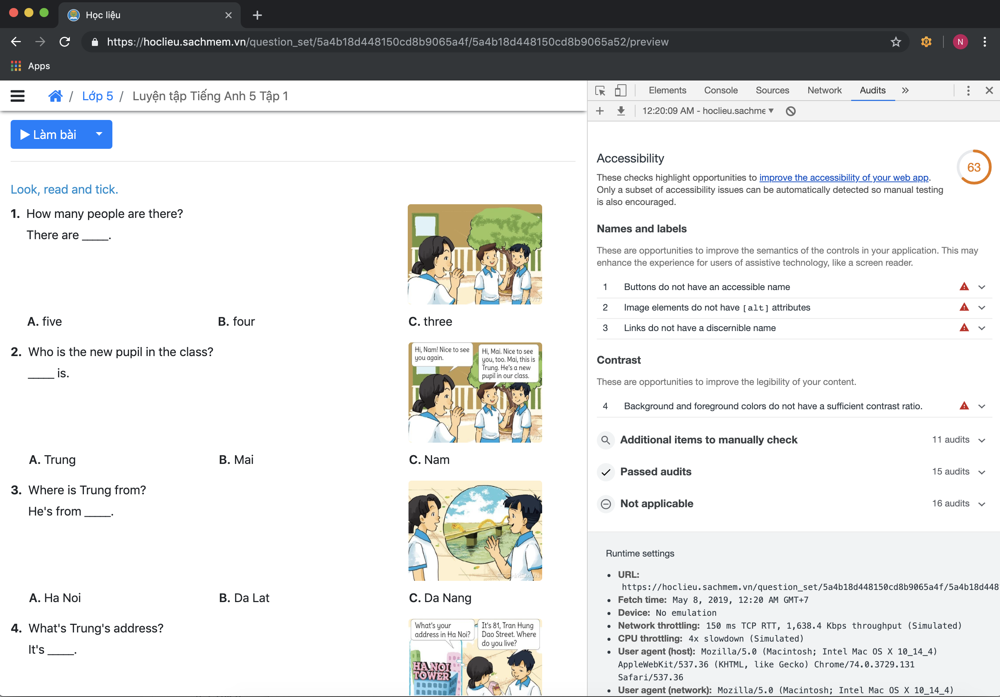

# <b>Accessibility Testing
## <b><u>Nhóm 1:</u></b>
- Nguyễn Xuân Việt Cường
- Dương Quang Khải
- Nguyễn Thị Linh

---
<b>1. Giới thiệu và cài đặt  
[Accessibility Developer Tools](https://www.youtube.com/watch?v=36YA7YeqTLM)
---
## <b>2. Kết quả </b>
- Kiểm thử Accessibility với trang : [Học liệu](https://hoclieu.sachmem.vn)
- Link video kiểm thử thực tế: [Accessibility Developer Tools](https://www.youtube.com/watch?v=36YA7YeqTLM&t=3m20s)
- Chúng tôi sẽ kiểm thử với 3 test
###  <b> 2.1. Kiểm thử tại trang chủ</b>
Tại trang chủ của trang [Học liệu](https://hoclieu.sachmem.vn) chúng ta thấy điểm Accessibility là 81  

- Ở đây chúng ta có thể cảnh báo không phù hợp ở các mục đó là 
  - <b><u>Contrast:</b></u> Độ tương phản của background và fogeground nhiều chỗ chưa phù hợp  

  
  => Như chúng ta thấy ở đây thì có 3 chỗ được khoanh đỏ là chưa phù hợp, click vào đấy chúng ta sẽ đến với dòng code của những mục chưa đúng. 

    
  - <b><u>Names and labels:</b></u> Tên và label chưa phù hợp: cụ thể là liên kết không được đặt tên rõ ràng 

    
###  <b> 2.2. Kiểm thử tại đăng nhập của trang</b>
Tại trang đăng nhập trang [Đăng nhập](https://accounts.sachmem.vn/users/sign_in) chúng ta thấy điểm Accessibility là 56

- Ở đây chúng ta thấy các cảnh báo khiến điểm Accessibility thấp được hiển thị ở trong ô màu đỏ 
- Các lỗi cụ thể như sau: 

###  <b> 2.3. Kiểm thử tại phần hiển thị tài liệu của trang </b>
Tại trang hiển thị tài liệu của trang chúng ta thấy điểm Accessibility là 63  

## <b>3. Kết luận </b> 
- Tool Accessibility Developer Tools dễ xử dụng và cài đặt với người mới bắt đầu học kiểm thử
- Dựa vào các thông báo của công cụ kiểm thử Accessibility Developer Tools chúng ta có thể thấy các cảnh báo không phù hợp được hiển thị từ đó chúng ta có thể dựa vào đấy để sửa và nâng cấp ứng dụng web cho phù hợp.