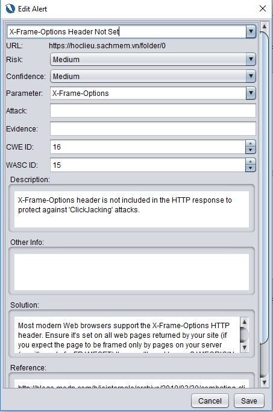

# <b>Security Testing
## <b><u>Nhóm 1:</u></b>
- Nguyễn Xuân Việt Cường
- Dương Quang Khải
- Nguyễn Thị Linh

---
<b>1. Giới thiệu và cài đặt  
[Security Testing](https://youtu.be/II8QIu-Ed64)
---
## <b>2. Kết quả </b>
- Kiểm thử Security với trang : [Học liệu](https://hoclieu.sachmem.vn)
- Link video kiểm thử thực tế: [Owasp Zap for Test Security](https://youtu.be/II8QIu-Ed64)

Sau khi Attack Active Scan đến url của trang cần test với user vừa tạo, click vào 1 dòng bất kỳ ta sẽ thấy Owasp Zap giả lập Request để tấn công và tìm lỗ hổng

Nếu có lỗ hổng nó sẽ hiển thị trong tab Alerts

Click đúp chuột vào các lỗ hổng, bạn sẽ thấy mô tả và hướng giải quyết lỗ hổng đó

Ở tab Response, những đoạn mã bị lỗi sẽ được làm nổi bật lên

